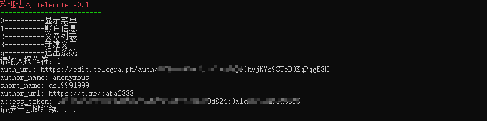
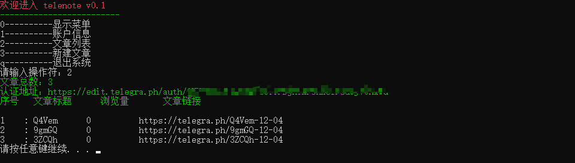
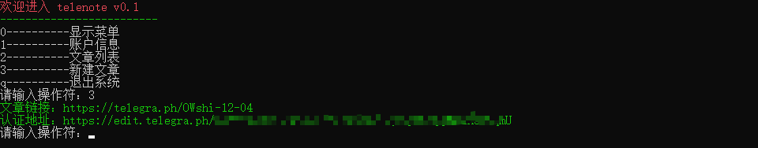

# TeleNote

[](https://github.com/ds19991999/TeleNote/issues)
[](https://github.com/ds19991999/TeleNote/blob/master/LICENSE)
[](https://github.com/ds19991999/TeleNote/releases)
[](https://996.icu/#/zh_CN)
[](https://github.com/ds19991999/TeleNote/stargazers)
[](https://github.com/ds19991999/TeleNote/fork)

[`telenote`](https://github.com/ds19991999/TeleNote) 使用 [`telegraph`](https://telegra.ph) 构建。[`telegraph`](https://telegra.ph) 官网无法编辑已发布的文章，并且没有提供账户管理，文章管理，于是该脚本应用诞生，通过使用唯一的 `access_token`创建文章，使用 `auth_url` 获取历史文章的编辑权限。目前，该应用还未正式开发，未来将构建客户端笔记应用，先留个坑吧 。。。

## 环境


```shell
git clone https://github.com/ds19991999/TeleNote.git
python3 -m pip install requests[socks]==2.22.0
```

## 配置

新建 `config.yaml` 文件，填写相关参数。

## 运行

`cmd` 直接运行即可，代理需要配置正确，否则会抛出 `requests.exceptions.ConnectionError` 异常。








## License

<a rel="license" href="http://creativecommons.org/licenses/by-nc-sa/4.0/"></a>